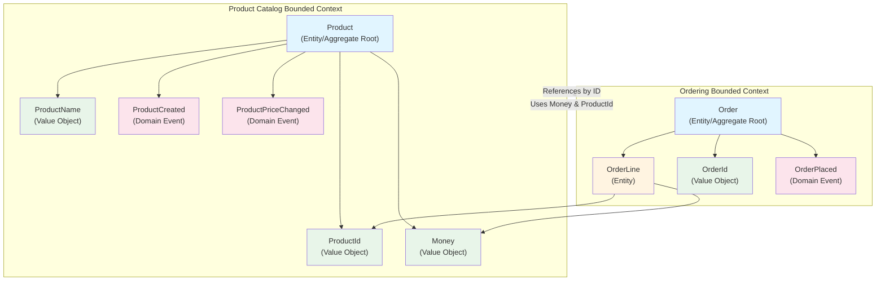

# Domain-Driven Design Architecture

This document describes how Domain-Driven Design (DDD) is applied in this ecommerce project.

## Overview

The project is organized into **Bounded Contexts**, each containing their own domain models, value objects, entities, and domain events. The contexts communicate through shared value objects and domain events, maintaining clear boundaries.

## Architecture Diagram



## Bounded Contexts

### Product Catalog Context

**Purpose**: Manages product information and pricing.

**Components**:
- **Product** (Entity/Aggregate Root)
  - Identity: `ProductId`
  - Properties: `ProductName`, `Money` (price)
  - Invariants: Name must not be empty, price must be non-negative
  - Domain Events: `ProductCreated`, `ProductPriceChanged`

**Value Objects**:
- `ProductId`: Unique identifier for products
- `ProductName`: Validated product name (trimmed, non-empty)
- `Money`: Amount and currency (amount ≥ 0, default currency: GBP)

**Domain Events**:
- `ProductCreated`: Emitted when a product is created
- `ProductPriceChanged`: Emitted when a product's price changes

### Ordering Context

**Purpose**: Manages customer orders and order lines.

**Components**:
- **Order** (Entity/Aggregate Root)
  - Identity: `OrderId`
  - Status: `Draft` | `Placed` | `Shipped`
  - Contains: `OrderLine[]`
  - Invariants: Can only modify when `Draft`, must have at least one line to place
  - Domain Events: `OrderPlaced`

- **OrderLine** (Entity within Order aggregate)
  - Properties: `ProductId` (reference), `quantity`, `unitPrice` (Money), `lineTotal` (Money)
  - Invariants: Quantity ≥ 1 and must be integer

**Value Objects**:
- `OrderId`: Unique identifier for orders

**Domain Events**:
- `OrderPlaced`: Emitted when an order is placed

## Cross-Context Communication

The Ordering context references the Product Catalog context **only by ID** (`ProductId`), maintaining loose coupling. Both contexts share the `Money` value object, which is defined in the Product Catalog context but used by both.

## DDD Patterns Used

### Value Objects
- Immutable objects defined by their attributes
- Examples: `ProductId`, `ProductName`, `Money`, `OrderId`
- All have validation in constructors and `equals()` methods

### Entities
- Objects with identity that can change over time
- Examples: `Product`, `Order`, `OrderLine`
- `Product` and `Order` are aggregate roots

### Aggregate Roots
- `Product`: Controls access to product data
- `Order`: Controls access to order and order lines

### Domain Events
- Immutable records of something that happened in the domain
- Used for eventual consistency and integration between bounded contexts
- Events are collected via `getDomainEvents()` and cleared with `clearDomainEvents()`

### Bounded Contexts
- Clear boundaries between Product Catalog and Ordering
- Each context has its own models and business logic
- Communication through shared value objects and domain events

## File Structure

```
src/domains/
├── product-catalog/
│   ├── product-id.ts
│   ├── product-name.ts
│   ├── money.ts
│   ├── product/
│   │   ├── product.ts
│   │   └── __tests__/
│   └── events/
│       ├── product-created.ts
│       └── product-price-changed.ts
└── ordering/
    ├── order-id.ts
    ├── order/
    │   ├── order.ts
    │   ├── order-line.ts
    │   └── __tests__/
    └── events/
        └── order-placed.ts
```
